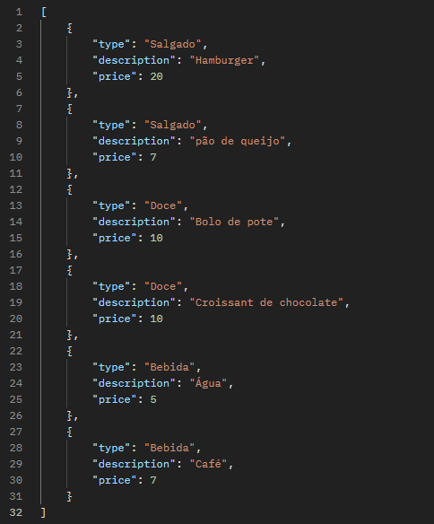
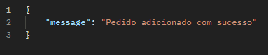

# StarCafé ☕🥐
Atividade proposta para o desenvolvimento de uma API REST para a StarCafé, permitindo que clientes realizem pedidos e que a administração gerencie o estoque de produtos.

## Aplicativos utilizados
VS Code, Postman.

## Dependências utilizadas
Express, Dotenv, Cors, Uuid, Nodemon.

## Endpoints
<li> GET /menu → Retorna o cardápio da cafeteria;
<li> POST /order → Permite que um cliente faça um pedido;
<li> GET /order/:id → Consulta o status de um pedido;
<li> DELETE /order/:id → Cancela um pedido (caso ainda não tenha sido preparado).

## Rotas
### GET /menu
Retorna o menu da cafeteria

#### Cabeçalho HTTP da Requisição
<li> Postman-Token: calculated when request is sent
<li> Host: localhost:3000
<li> User-Agent: PostmanRuntime/7.43.0
<li> Accept:  */*
<li> Accept-Encoding: gzip, deflate, br
<li> Connection: keep-alive 

#### Cabeçalhos HTTP da resposta
<li> X-Powered-By: Express
<li> Access-Control-Allow-Origin: *
<li> Content-Type: application/json;charset=utf-8
<li> Content-Length: 339
<li> ETag: W/"153-6XIGKZw74sjN8KlsLwWqYZrfgE0"
<li> Date: 	
Thu, 20 Feb 2025 00:01:52 GMT
<li> Connection: keep-alive
<li> Keep-Alive: 	
timeout=5

#### Corpo da resposta (JSON)

#### Código de Status
<li> ✔️ 200 OK: Sucesso: client fez uma requisição GET para rota /menu 
<li> ✖️ 404 NOT FOUND: Erro: cliente fez uma requisição GET para uma rota errada

### POST /order
Permite que um cliente faça um pedido

#### Cabeçalho HTTP da Requisição
<li> Postman-Token: calculated when request is sent
<li> Content-Type: application/json
<li> Content-Length: calculated when request is sent 
<li> Host: localhost:3000
<li> User-Agent: PostmanRuntime/7.43.0
<li> Accept: */*
<li> Accept-Encoding: gzip, deflate, br
<li> Connection: keep-alive 

#### Cabeçalhos HTTP da resposta
<li> X-Powered-By: Express
<li> Access-Control-Allow-Origin: *
<li> Content-Type: application/json;charset=utf-8
<li> Content-Length: 43
<li> ETag: W/"2b-Z5x2XiBKOmrr1Yv5Btq8fNyA+fE"
<li> Date: 	
Thu, 20 Feb 2025 00:27:59 GMT
<li> Connection: keep-alive
<li> Keep-Alive: 	
timeout=5

#### Corpo da resposta (JSON)

#### Código de Status
<li> ✔️ 200 OK: Sucesso: Cliente realiza o pedido
<li> ✖️ 400 BAD REQUEST: Erro do Cliente: Não preenche todos os campos obrigatórios
<li> ✖️ 400 BAD REQUEST: Erro do Cliente: Pede um item que não está no menu
<li> ✖️ 400 BAD REQUEST: Erro do Cliente: Não insere um valor numérico no preço do item

### GET /order/:id
Consulta o status de um pedido

#### Cabeçalho HTTP da Requisição
<li> Postman-Token: calculated when request is sent
<li> Host: localhost:3000
<li> User-Agent: PostmanRuntime/7.43.0
<li> Accept: */*
<li> Accept-Encoding: gzip, deflate, br
<li> Connection: keep-alive 

#### Cabeçalhos HTTP da resposta
<li> X-Powered-By: Express
<li> Access-Control-Allow-Origin: *
<li> Content-Type: application/json;charset=utf-8
<li> Content-Length: 133
<li> ETag: W/"85-lWkU0uieo8r3ITn2pdnCQBDgFHM"
<li> Date:	
Thu, 20 Feb 2025 00:59:55 GMT
<li> Connection: keep-alive
<li> Keep-Alive: 	
timeout=5

#### Corpo da resposta (JSON)

#### Código de Status
<li> ✔️ 200 OK: Sucesso: Cliente consulta pedido e seu status
<li> ✖️ 400 NOT FOUND: o ID requisitado não existe

### DELETE /order/:id 
Cancela um pedido (caso ainda não tenha sido preparado).

#### Cabeçalho HTTP da Requisição
<li> Postman-Token: calculated when request is sent
<li> Host: localhost:3000
<li> User-Agent: PostmanRuntime/7.43.0
<li> Accept: */*
<li> Accept-Encoding: gzip, deflate, br
<li> Connection: keep-alive 

#### Cabeçalhos HTTP da resposta
<li> X-Powered-By: Express
<li> Access-Control-Allow-Origin: *
<li> Content-Type: application/json;charset=utf-8
<li> Content-Length: 42
<li> ETag: 	
W/"2a-JkqQMyByIpTYQrVi6WTMpgThp6M"
<li> Date:	
Thu, 20 Feb 2025 01:11:21 GMT
<li> Connection: keep-alive
<li> Keep-Alive: 	
timeout=5

#### Corpo da resposta (JSON)

#### Código de Status
<li> ✔️ 200 OK: Cliente cancela pedido
<li> ✖️ 404 NOT FOUND: o ID requisitado não existe
<li> ✖️ 400 FORBIDDEN : Pedido não pode ser cancelado pois já está sendo preparado ou já foi concluído

